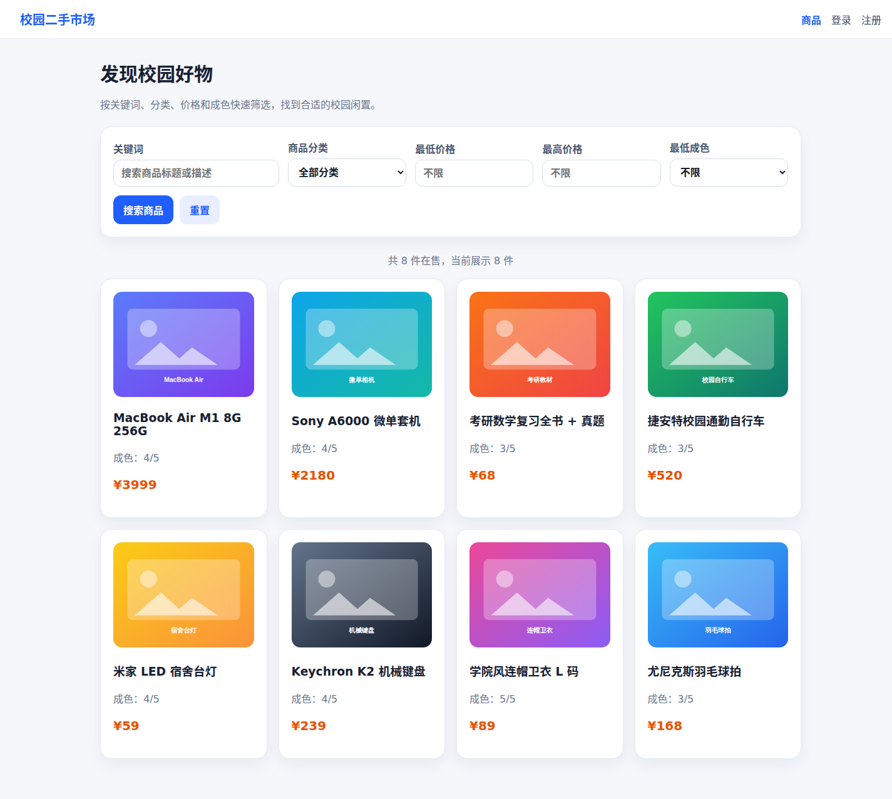
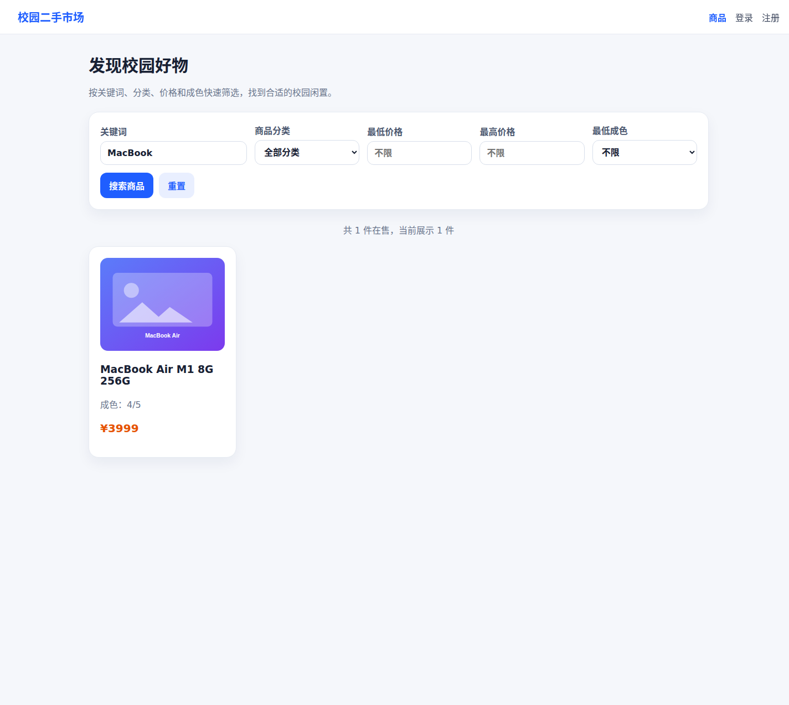
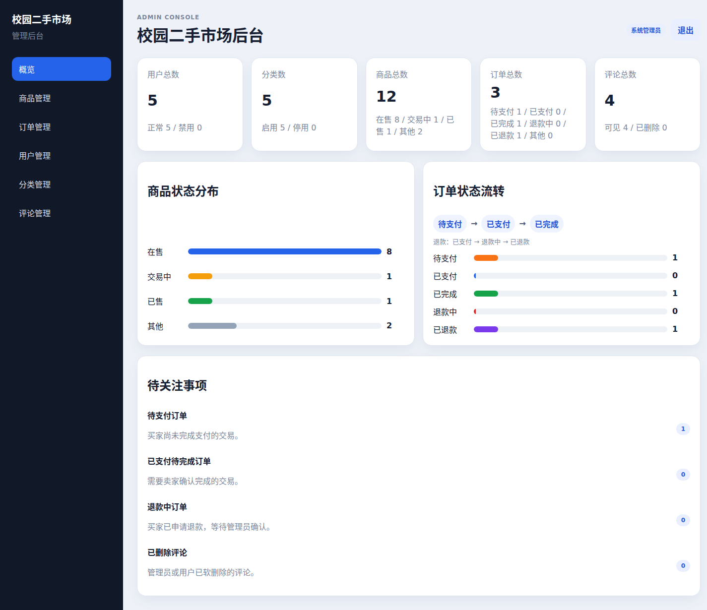

# Campus Market SpringBoot Vue

基于 Spring Boot 3 + Vue 3 的校园二手交易平台，覆盖用户端、管理后台、JWT 鉴权、商品发布、搜索筛选、图片上传、收藏评论、订单流转、退款处理和后台统计看板。

## 项目亮点

- **前后端分离架构**：后端使用 Spring Boot 3 / Spring Security 6 / MyBatis Plus，前端使用 Vue 3 / Vite / TypeScript。
- **完整交易闭环**：商品发布、浏览搜索、收藏评论、下单、支付确认、交易完成、取消和退款流转。
- **管理后台**：用户、商品、订单、分类、评论统一管理，首页提供统计卡片、商品状态分布和订单状态流转图。
- **工程化能力**：Flyway 管理数据库迁移，springdoc-openapi 输出接口文档，Docker Compose 支持一键启动 MySQL、Redis、后端、用户端和管理后台。
- **演示数据**：提供可重复执行的 demo 数据重置脚本，便于本地演示和截图录屏。

## 项目截图

| 用户端首页 | 商品搜索筛选 |
| --- | --- |
|  |  |

| 管理后台统计看板 |
| --- |
|  |

## 技术栈

| 模块 | 技术 |
| --- | --- |
| 后端 | Java 17、Spring Boot 3.5、Spring Security 6、JWT、MyBatis Plus、Flyway、springdoc-openapi |
| 数据库/中间件 | MySQL 8.4、Redis 7.4 |
| 用户端 | Vue 3、Vite、TypeScript、Vue Router、Pinia、Axios |
| 管理后台 | Vue 3、Vite、TypeScript、Vue Router、Axios |
| 部署 | Docker Compose、Nginx、Maven |

## 目录结构

```text
campus-market-springboot-vue/
├── apps/
│   ├── backend/      # Spring Boot 3 后端
│   ├── web/          # Vue 3 用户端
│   └── admin/        # Vue 3 管理后台
├── database/         # SQL 备份，运行时迁移以 Flyway 为准
├── docs/             # API 文档、项目结构、截图和升级记录
├── infra/            # Docker/部署配置预留目录
├── scripts/          # 本地开发脚本
├── docker-compose.yml
└── README.md
```

详细结构见：[`docs/project-structure.md`](docs/project-structure.md)  
接口文档见：[`docs/api.md`](docs/api.md)

## 快速启动

### 方式一：本地脚本启动

先确保本地 MySQL 已启动，然后初始化数据库和应用用户：

```bash
./scripts/dev/init-db.sh
```

重置演示数据：

```bash
./scripts/dev/reset-demo-data.sh
```

一键启动后端、用户端和管理后台：

```bash
./scripts/dev/start-all.sh
```

分别启动：

```bash
./scripts/dev/start-backend.sh
./scripts/dev/start-web.sh
./scripts/dev/start-admin.sh
```

访问地址：

- 后端 API：`http://localhost:8080`
- Swagger UI：`http://localhost:8080/swagger-ui.html`
- 用户端：`http://localhost:5173`
- 管理后台：`http://localhost:5174`

### 方式二：Docker Compose 启动

```bash
docker compose up --build
```

容器启动后访问：

- 用户端：`http://localhost:5173`
- 管理后台：`http://localhost:5174`
- 后端 API：`http://localhost:8080`
- Swagger UI：`http://localhost:8080/swagger-ui.html`

Docker Compose 会启动：

- MySQL 8.4
- Redis 7.4
- Spring Boot 后端
- Vue 用户端 Nginx 静态服务
- Vue 管理后台 Nginx 静态服务

## 演示账号

演示账号统一密码：

```text
admin123456
```

常用账号：

| 账号 | 角色 | 说明 |
| --- | --- | --- |
| `admin` | 管理员 | 访问管理后台 |
| `seller_lin` | 用户 | 商品发布者 |
| `seller_chen` | 用户 | 商品发布者 |
| `buyer_wang` | 用户 | 买家 |
| `buyer_zhao` | 用户 | 买家 |

## 核心功能

### 用户端

- 注册、登录、JWT 会话保持
- 商品列表、分类筛选、关键词搜索、价格区间、最低成色筛选
- 商品详情、图片展示、评论区
- 发布商品、编辑商品、下架、重新上架
- 商品收藏、我的收藏
- 创建订单、买到/卖出订单、支付确认、完成交易、取消和退款
- 个人中心：修改昵称、修改密码

### 管理后台

- 管理员登录和角色鉴权
- 统计看板：用户、分类、商品、订单、评论统计
- 商品状态分布图、订单状态流转图、待关注事项
- 用户启用/禁用
- 商品管理和违规下架
- 订单状态筛选、异常订单强制取消、退款确认
- 分类新增、编辑、启用/禁用
- 评论管理和软删除

## 订单流转

```text
PENDING_PAYMENT  待支付
   │
   ├── 买家取消 / 管理员强制取消 -> CANCELED
   │
   └── 买家确认支付 -> PAID
              │
              ├── 卖家确认完成 -> COMPLETED，商品变为 SOLD
              │
              └── 买家申请退款 -> REFUNDING -> 管理员确认退款 -> REFUNDED，商品恢复 ON_SALE
```

关键规则：

- 买家不能购买自己发布的商品。
- 下单后商品锁定为 `LOCKED`，避免重复购买。
- 已支付订单不能普通取消，只能走完成或退款流程。
- 退款确认由管理员处理。

## 接口文档

- Swagger UI：`http://localhost:8080/swagger-ui.html`
- Markdown 文档：[`docs/api.md`](docs/api.md)

常用接口：

```text
POST /api/auth/login
GET  /api/goods?keyword=MacBook&minPrice=1000&minCondition=4
POST /api/goods
POST /api/orders
GET  /api/admin/dashboard
GET  /api/admin/orders?status=REFUNDING
```

## 开发与验证

后端：

```bash
cd apps/backend
mvn -q test
```

用户端：

```bash
cd apps/web
npm install
npm run dev
npm run build
```

管理后台：

```bash
cd apps/admin
npm install
npm run dev
npm run build
```

截图生成：

```bash
node scripts/dev/capture-screenshots.mjs
```

## 环境变量

后端常用环境变量：

| 变量 | 说明 |
| --- | --- |
| `SPRING_PROFILES_ACTIVE` | 默认 `dev`，生产可设为 `prod` |
| `DB_URL` | MySQL JDBC 地址 |
| `DB_USERNAME` | 数据库用户名 |
| `DB_PASSWORD` | 数据库密码 |
| `REDIS_HOST` | Redis 地址 |
| `REDIS_PORT` | Redis 端口 |
| `APP_JWT_SECRET` | JWT 密钥 |
| `APP_ADMIN_USERNAME` | 默认管理员用户名 |
| `APP_ADMIN_PASSWORD` | 默认管理员密码 |
| `APP_CORS_ALLOWED_ORIGINS` | CORS 白名单 |
| `APP_UPLOAD_DIR` | 上传文件保存目录 |
| `APP_UPLOAD_PUBLIC_PATH` | 上传文件公开访问路径 |

生产环境不要使用默认 JWT secret 和默认管理员密码。

## 后续可扩展方向

- Redis 缓存分类和热门商品榜单。
- 管理员操作日志和审核记录。
- 商品审核流：待审、通过、驳回。
- 更细的推荐排序和浏览量统计。
